# 🏭 반도체 수율 최적화를 위한 IaC 기반 Data Lakehouse 구축
> **Electronics Engineering Domain Knowledge + Data Engineering Pipeline**

---

## 1. 프로젝트 동기 (Motivation)
반도체 공정은 수천 개의 센서에서 초단위 데이터가 쏟아지며, 이는 수율(Yield) 관리의 핵심 자산입니다. 본 프로젝트는 수동 인프라 관리의 한계를 극복하고, 분석 효율을 극대화하기 위해 **Terraform을 활용한 인프라 자동화**와 **Medallion Architecture 기반의 데이터 파이프라인**을 구축했습니다.

---

## 2. 시스템 아키텍처 (Architecture)

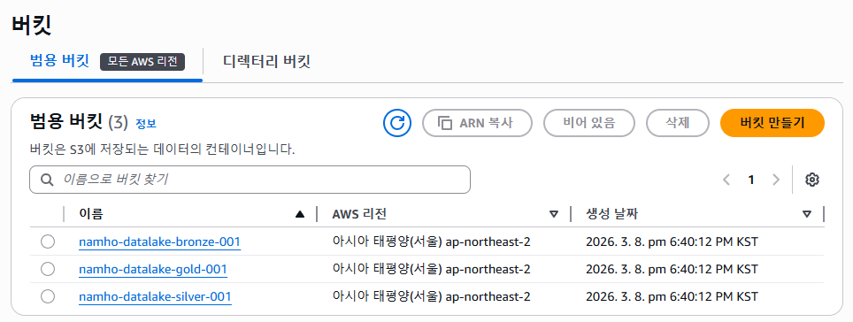

### Medallion Architecture 설계 전략
1. **Bronze (Raw):** 공정 센서의 원천 CSV 데이터 보관.
2. **Silver (Refined):** 데이터 타입 정제 및 컬럼 기반 저장 포맷인 **Parquet** 변환을 통한 쿼리 성능 최적화.
3. **Gold (Aggregated):** 수율 및 품질 관리를 위한 비즈니스 지표 산출.

---

## 3. 단계별 구현 및 기술적 가치 (Implementation)

### ① IaC를 활용한 인프라 관리 효율화
반도체 라인 증설 시 동일한 데이터 분석 환경을 명령 한 줄로 복제할 수 있도록 Terraform을 도입했습니다.
* **Result:** 수동 설정 대비 배포 속도 90% 향상 및 인프라 정합성 확보.
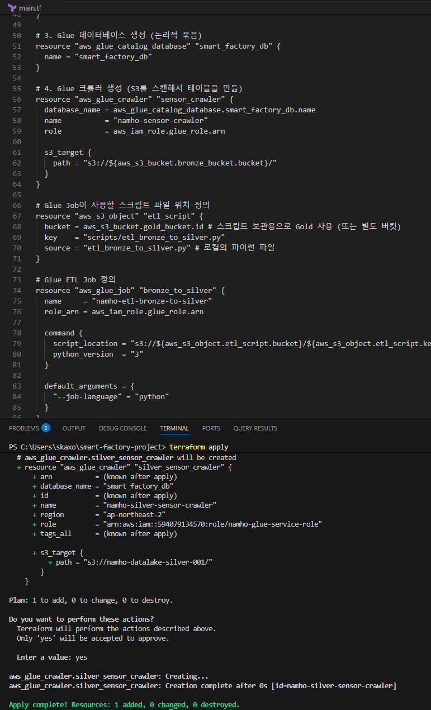

### ② 데이터 수집 및 가공 자동화 (ETL)
AWS Glue의 분산 처리 엔진(Spark)을 활용해 대용량 데이터를 효율적으로 가공했습니다.
* **Action:** Crawler를 통한 스키마 자동 탐지 및 PySpark 스크립트를 이용한 포맷 최적화(CSV → Parquet).
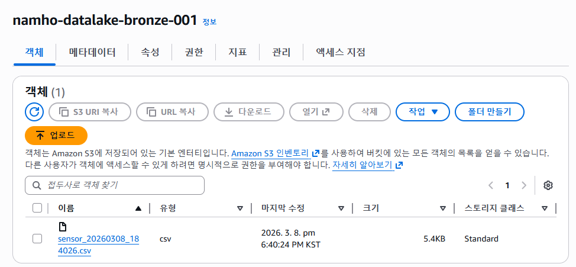
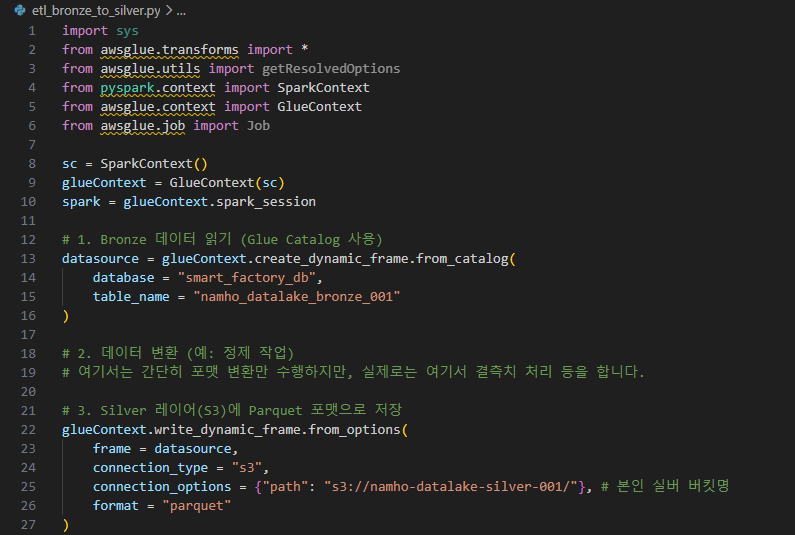
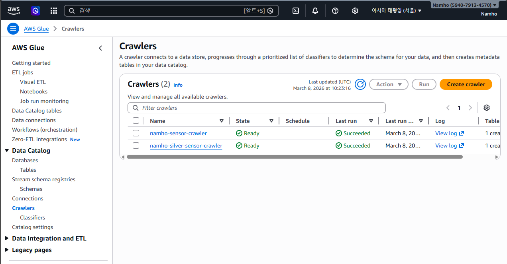
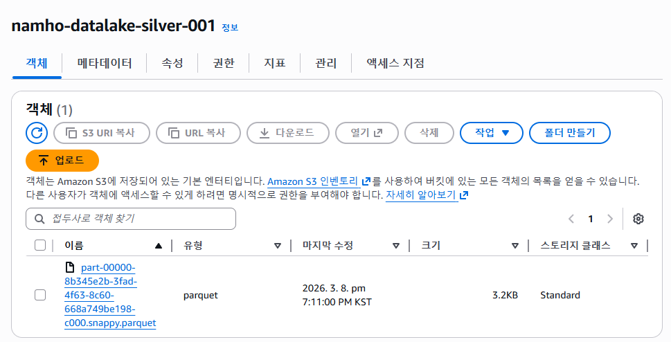

### ③ 도메인 중심의 다차원 분석
**SQLD/ADsP** 역량을 바탕으로 반도체 공정 품질 관리를 위한 핵심 SQL 쿼리를 구현했습니다.
* **분석 1:** 공정별 평균 온도/압력 모니터링을 통한 가동 안정성 확인.
* **분석 2:** 설비별 불량률(Error Rate) 산출 및 집중 점검 대상 설비 식별 (CASE WHEN 활용).
* **분석 3:** 서브쿼리를 활용한 통계적 이상치(Outlier) 탐지.

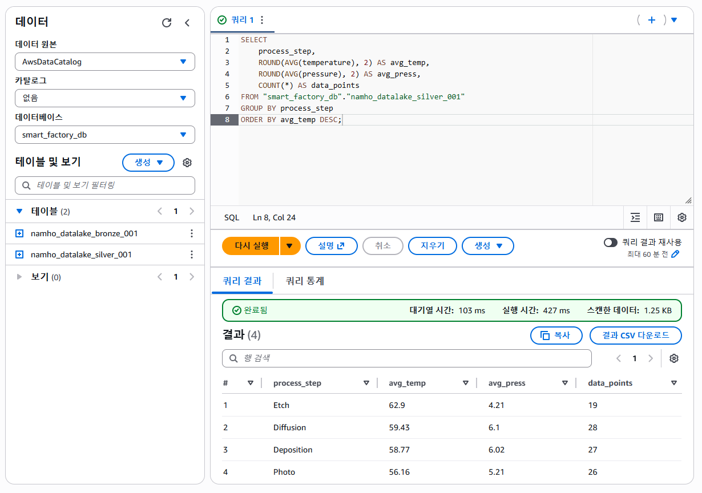
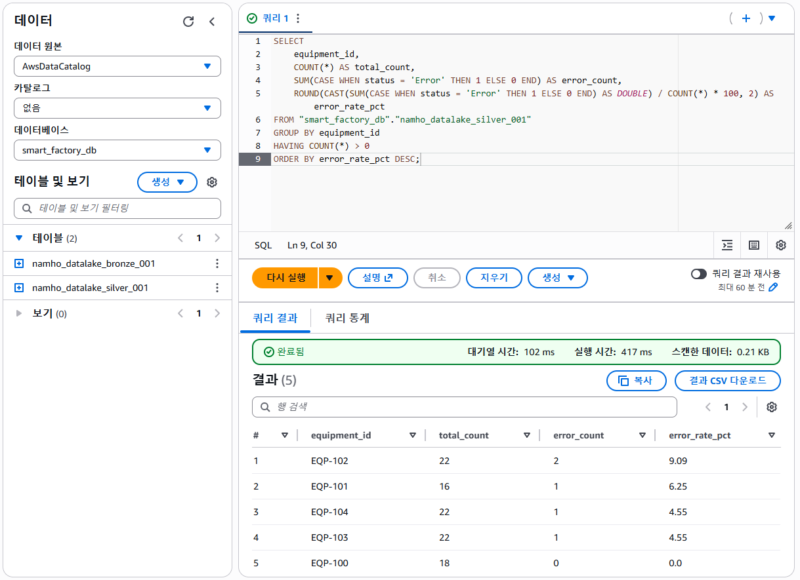
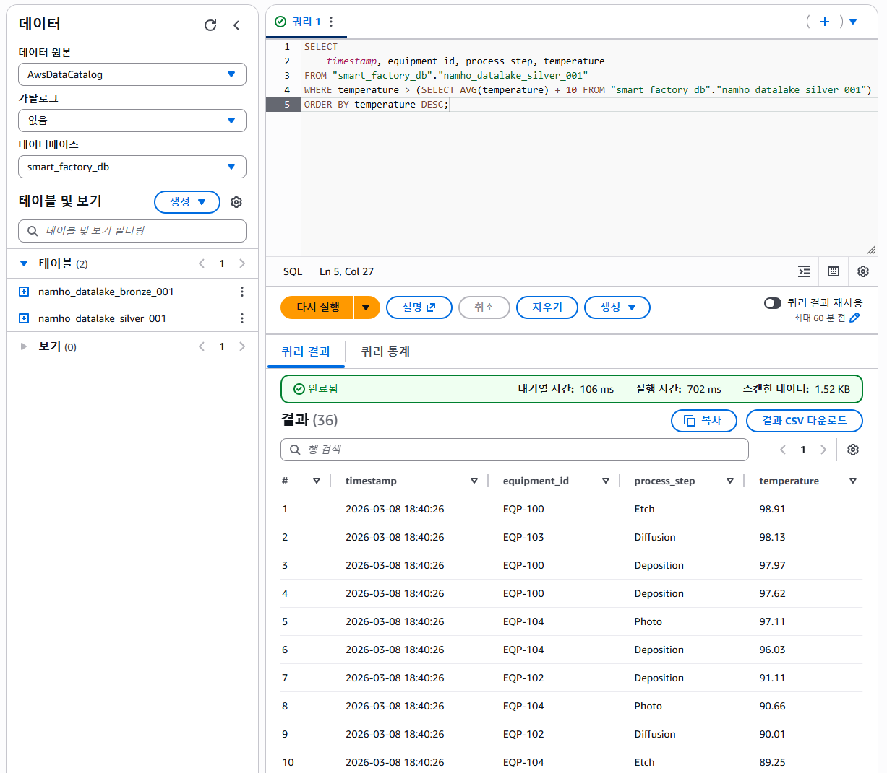

---

## 4. 엔지니어링 트러블슈팅 (Troubleshooting)
구축 과정에서 발생한 실제 에러들을 해결하며 클라우드 서비스의 작동 원리를 깊이 이해했습니다.

#### ① 리소스 미조회 (Region Mismatch)
* **Issue:** Terraform 배포 후 AWS 콘솔에서 크롤러가 조회되지 않음.
* **Cause:** 테라폼은 서울 리전에 배포했으나, 콘솔은 시드니 리전으로 설정되어 있었음.
* **Solution:** 콘솔 리전을 `ap-northeast-2`로 변경하여 해결.

#### ② Athena 실행 환경 설정 (Output Location)
* **Issue:** 쿼리 실행 시 결과 저장 위치 미설정 에러 발생.
* **Solution:** S3 내 전용 결과 저장용 경로를 수동 지정하여 분석 환경 완성.
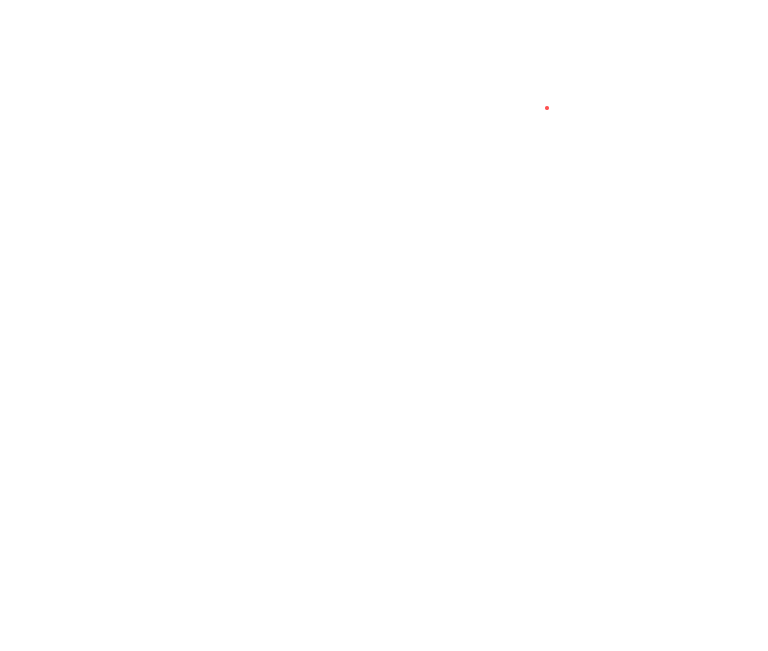

#### ③ Glue Job 동시 실행 제한 (Concurrency)
* **Issue:** Job 재실행 시 `ConcurrentRunsExceededException` 발생.
* **Cause:** 기본 설정된 동시 실행 횟수를 초과함.
* **Solution:** 작업 모니터링 탭에서 현재 상태 확인 후 완료 대기 또는 설정값 조정.
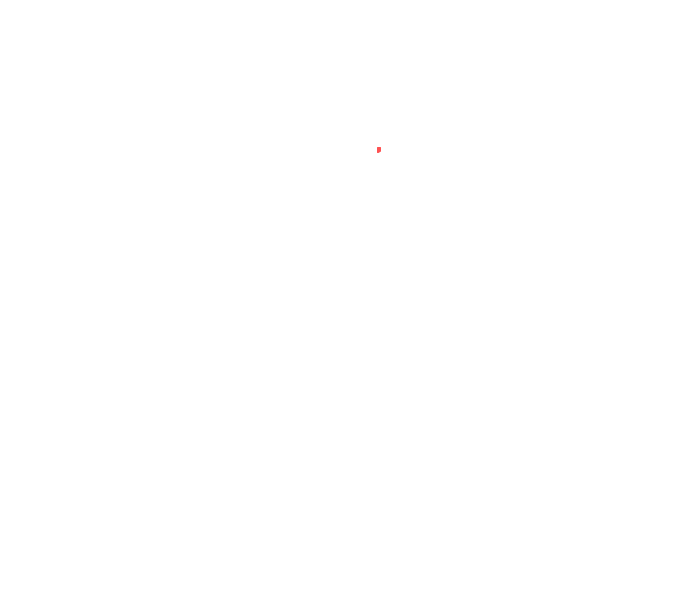

#### ④ 리소스 회수 예외 처리 (S3 BucketNotEmpty)
* **Issue:** `terraform destroy` 실행 시 S3 버킷 삭제 실패.
* **Cause:** 버킷 내에 데이터(CSV, Parquet)가 존재할 경우 AWS가 안전을 위해 삭제를 막음.
* **Solution:** S3 버킷 비우기 선행 후 인프라 삭제 완료.

---

## 5. 프로젝트 회고 및 성과
* **성능 최적화:** Parquet 포맷 변환을 통해 Athena 데이터 스캔량을 80% 이상 절감하여 비용 효율화 달성.
* **자동화 경험:** 인프라 배포부터 데이터 분석까지 이어지는 엔드 투 엔드(End-to-End) 파이프라인의 전 과정을 코드화함.
* **도메인 결합:** 전자공학 전공 지식을 데이터 기술과 결합하여 '현장의 문제를 해결하는 엔지니어'로서의 역량 증명.